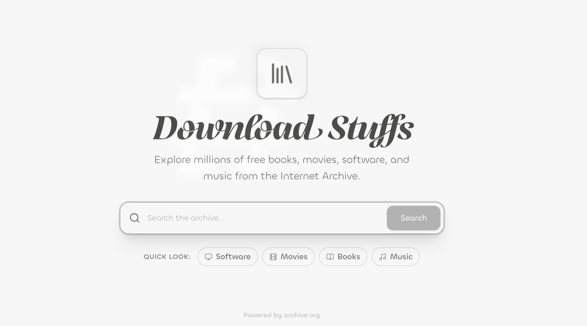
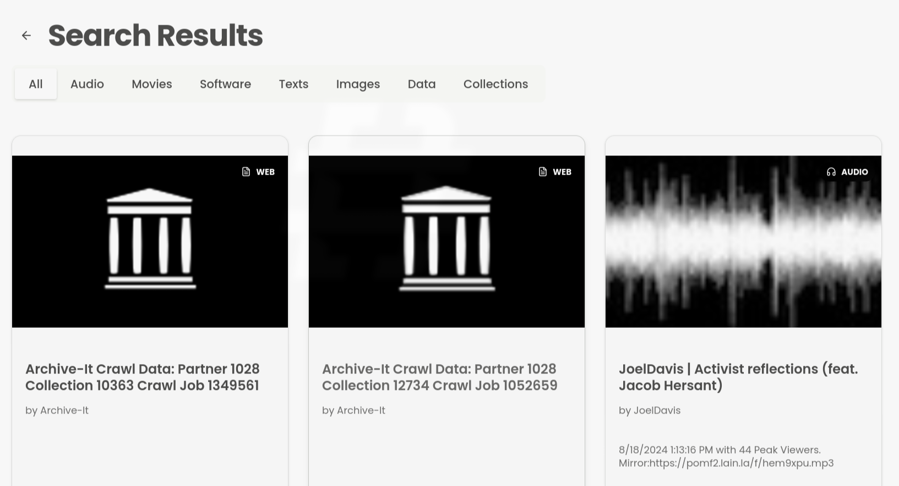

# DownloadStuffs

[](LICENSE)
[](https://downloadstuffss.vercel.app/)

Fast, modern UI for exploring Internet Archive items: search, sort, preview, and reliably download single files or entire playlists.

Live demo: https://downloadstuffss.vercel.app/

## Why 

Internet Archive is a massive public library, but the default experience can be slow to browse on mobile, hard to preview long multi-file items (series/episodes), and annoying to download (CORS, flaky direct downloads, unclear “best file”).

DownloadStuffs focuses on:

- Speed: server-side pagination + fast search
- Clarity: opinionated defaults + clean detail pages
- Completion: download proxy + playlist downloads + in-page player queue

## What you get

- Search + filters
	- Media-type filtering (movies, audio, texts, software, etc.)
	- Sort results by relevance, downloads, recent, views
	- Real server-side pagination (accurate total pages)
- Item detail page
	- Video/audio preview, image gallery
	- Playlist/episodes view for multi-file items
	- “All files” browser with search + grouping
	- Back navigation preserves your query/page/type/sort
- Downloads
	- `/api/download` proxy for reliable browser downloads
	- Playlist ZIP download (`/api/download/playlist`) to batch-download video/audio/playlist files
- Player UX
	- Custom player with keyboard shortcuts
	- Playlist queue + next/prev + auto-advance
	- Fullscreen + PiP

## Screenshots

Home



Results



Detail


Player (fullscreen)


## Quickstart

### Requirements

- Node.js 20+
- Package manager: `pnpm` (recommended; lockfile included) or `bun`

### Run locally

```bash
pnpm install
pnpm dev
```

Or with Bun:

```bash
bun install
bun dev
```

Dev server: http://localhost:3000

### Build & run (production)

```bash
pnpm build
pnpm start
```

Or with Bun:

```bash
bun run build
bun run start
```

## How it works

- Search uses the Internet Archive Advanced Search API (`https://archive.org/advancedsearch.php`).
	- Sorting is passed through to IA via `sort[]`.
- Item details use IA metadata (`https://archive.org/metadata/:id`).
- Streaming downloads use IA download URLs (`https://archive.org/download/:id/:file`).
- The app proxies downloads to avoid browser/CORS issues and support more reliable file downloads.

## Routes (reference)

- `/` — home search
- `/result?q=...&page=1&type=movies&sort=relevance` — results
- `/result/:id` — item details
- `/api/download?id=:id&file=:filename` — download proxy
- `/api/download/playlist?id=:id&kind=video|audio|playlist|all&source=original|all&max=...` — streaming zip

## SEO

- Robots file: [public/robots.txt](public/robots.txt)
- Sitemap: `/sitemap/xml` (generated dynamically from the current domain)

## Configuration

### Environment variables

Optional (controls upstream timeout for downloads):

- `ARCHIVE_UPSTREAM_TIMEOUT_MS` (default: `20000`)

On Vercel: Project Settings → Environment Variables.

## FAQ

### Is this affiliated with Internet Archive?

No. This project is community-built and uses public endpoints provided by https://archive.org/.

### Why do some items not play?

Some items don’t have stream-friendly files (or are restricted). In that case, the page still shows metadata and available downloads.

## Contributing

Contributions are welcome.

- Read: [CONTRIBUTING.md](CONTRIBUTING.md)
- Security policy: [SECURITY.md](SECURITY.md)
- Code of conduct: [CODE_OF_CONDUCT.md](CODE_OF_CONDUCT.md)

## Roadmap

- Better structured data (JSON-LD) for richer Google results
- Improve sitemap coverage (safe, non-crawling strategy)
- More download formats + smarter batch downloads
- Better error UI for upstream timeouts

## License

MIT — see [LICENSE](LICENSE)
